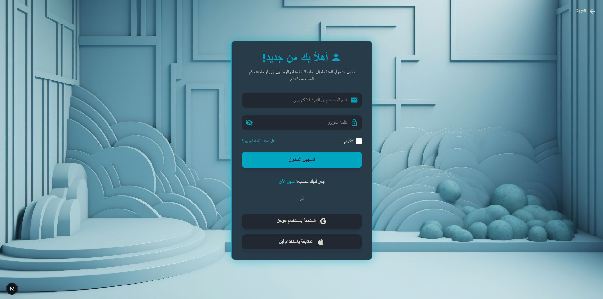

# نظام مصادقة وتسجيل دخول متكامل (Back + Front)

## فكرة المشروع

مشروع متكامل يضم واجهتين: باك اند (Node.js/Express/PostgreSQL) وفرونت اند (Next.js/React)، يدعم إنشاء حساب متعدد الخطوات وتسجيل دخول وحفظ الجلسات باستخدام JWT، بالإضافة إلى ملفات شخصية غنية لكل مستخدم. تم بناء النظام بالكامل ليدعم اللغة العربية واتجاه RTL، ويشتمل على حماية وتوثيق متقدم (hash + token) وواجهة عصرية متجاوبة.

## أبرز المزايا
- تسجيل دخول/خروج وحماية باستخدام JWT مع صلاحيات المستخدم (عادي وأدمن)
- إنشاء حساب جديد متعدد المراحل: بيانات أساسية ثم معلومات إضافية
- تحديث واستعراض الملف الشخصي مع فصل معلومات المستخدم الأساسية عن المعلومات الإضافية (جدول منفصل)
- خيارات تحرير وحذف الحساب
- واجهة بالكامل بالعربية وتدعم RTL بشكل كامل
- توثيق API باستخدام Swagger
- شيفرة منظمة وقابلة للتوسعة لأي نظام أكبر مستقبلاً

## ملخص التقنيات المستخدمة
- **Backend:** Node.js, Express, PostgreSQL, JWT, bcrypt, Swagger
- **Frontend:** Next.js, React, TypeScript, MUI, Tailwind CSS, Emotion

## خطوات التشغيل السريعة:
1. أدخل مجلد backend وثبّت الحزم وأطلِق السيرفر.
2. أدخل مجلد frontend وثبّت الحزم وأطلق السيرفر.
(تجد تفاصيل أكثر في ملفات README الفرعية)

## للتجربة:
- واجهتك الرئيسية: http://localhost:3000
- نقطة API: http://localhost:5000

---
